# Backtest Vault

**Keep the evidence behind every backtest.**

A local Chrome extension and research workspace for Definedge momentum and portfolio backtests. Start in Vault: choose your setup, run one test or several variations, and compare the saved evidence.

[](https://github.com/mamamiya7/backtest-vault/actions/workflows/checks.yml)
**v0.9.0 preview** · Chrome · Local storage · MIT · No cloud account

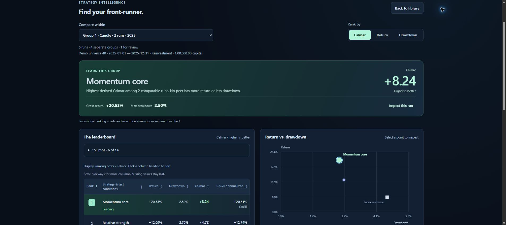

**All screenshots and demo records are fictional.** They illustrate the product, not investment performance.

[Try it](#try-the-demo) · [Install](#install-the-extension) · [Compare strategies](#how-the-ranking-works) · [Understand the numbers](#cagr-or-annualized-return) · [Backups](#where-your-data-lives) · [Develop](#development)

## Start in Vault

**You do not need a saved backtest to begin.** Open the installed Vault and choose **New test**. RZone calculates the results; Vault applies your setup and saves each completed report.

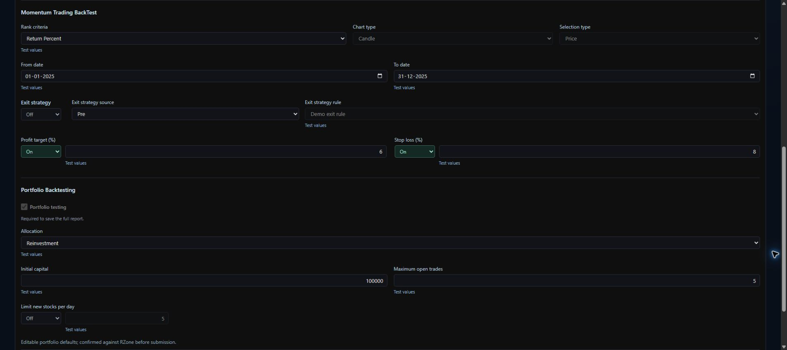

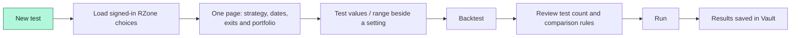

1. **Open New test:** keep RZone signed in. With one available RZone tab, Vault loads its choices automatically. If several tabs are available, select one and click **Connect RZone**. Loading choices does not run a backtest.
2. **Set up on one page:** periods, weights, filters and Strategy 1–3 follow RZone's arrangement. Momentum Trading BackTest sits below the strategy controls; Portfolio Backtesting follows underneath. Search and select **Group** from the choices read from RZone. Arrow keys and Enter also work.
3. **Add variations beside a setting:** Period 1 = `252,500` means two tests. A numeric range also needs a step. Choose **Off** to skip a period or filter, **On** to use it, or **Test both** for separate On and Off runs. Eligible rule menus can test selected choices from the loaded source catalogue.
4. **Backtest:** check the compact summary, test count and comparison rules, then choose **Run … tests**. All source settings are already editable on the main page. Leave the range controls unused to run the current setup once.
5. **Results:** Vault saves each report automatically. Open a saved trial or compare the batch in **Decision desk**. Exporting is an optional backup, not a step required to finish a run.

**New test** and **Refresh choices** load Group and the native dropdowns for **Radar**, **Strategy 1–3** and **Exit Strategy**, temporarily enabling each source row and restoring its settings afterward. Radar currently offers **Pre / My**. Strategy and exit **Pre / Popular** are dropdowns; strategy/exit **My / Public** are searches in RZone. Choose a category in Vault, enter a strategy name or keyword and click **Search** for those searchable categories, then select a returned rule. An untouched search is not an empty account; a completed search with no matches shows that explicitly. Identical names are unavailable for automatic selection because the source identity would be ambiguous. Each category retains its own rule and Test values while you edit. Refresh again after adding rules in RZone; removed choices stay visible for review. Fresh connected setups currently support NSE; other markets require a separate form adapter. Loading or searching choices never submits a backtest.

**Example:** two start dates × two allocation methods × two capital amounts = **8 tests**. Add dates with calendar inputs, select offered menu values, or use numeric From / To / Step ranges. The review checks every date combination before any test starts.

Keep RZone open during execution and leave its settings alone until the batch finishes. **Use a saved run** remains available in Experiments for an existing research baseline.

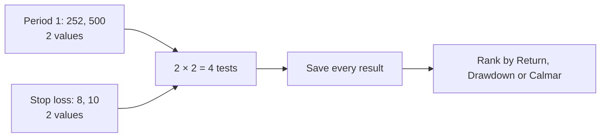

Use **Test values** on start/end dates and rank criteria too. Portfolio allocation, initial capital, maximum open trades and daily limits have their own variation controls. Different dates or portfolio assumptions form separate comparison groups; a highlighted setting leads only within its matched group. Universe, market, chart model and rule-source categories stay fixed in the current adapter.

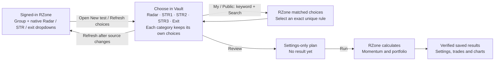

[Open the fictional experiment demo](http://127.0.0.1:8767/?demo=1&view=experiments) or read the [full workflow and recovery guide](docs/EXPERIMENTS.md).

| Available in 0.9.0 preview | Acceptance boundary |
| --- | --- |
| Vault-first Candle/Price setup, source dropdown refresh and single or multiple tests | New flow covered by local checks; live acceptance of this full setup flow remains pending |
| Finite plans, reproducible samples, bounded adaptive neighborhood search | Local planner and isolated simulation tested |
| Persistent queue, one source tab, save acknowledgement, pause/recovery | The preceding v0.7.3 saved-baseline flow completed three real Candle trials; this does not validate every new setup option |
| Frozen decision rules, neighboring-setting checks, baseline/index context, validation and holdout stages | Descriptive research evidence; no predictive or pooled portfolio score |
| P&F and Renko plans | Live execution gated pending separate write tests |

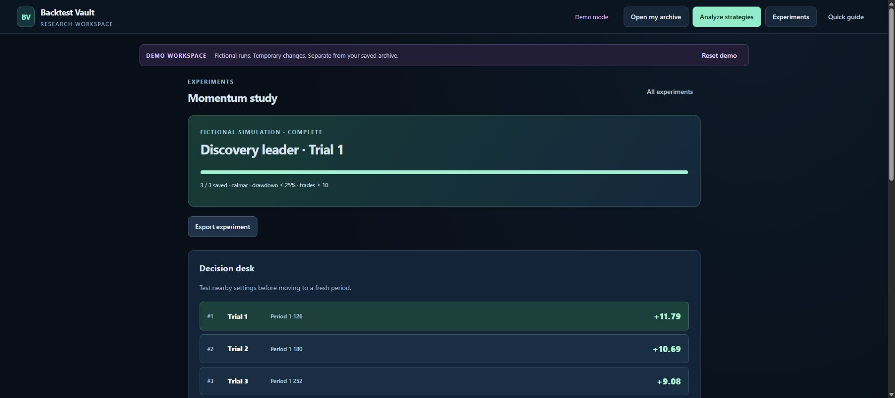

No LLM setup is required. Current automatic setup uses **NSE**, **Candle**, **Price**, **Relative Strength off** and **Market Trend Filter off**. P&F/Renko execution and dynamic RS/filter adapters remain on the delivery plan. Existing captures from those chart families can still be inspected and compared. A [consolidated source-control audit](docs/EXPERIMENTS.md#chart-and-dependent-control-coverage) records the broader form dependencies separately from automation support.

### Sample results or a real backtest?

| Workspace | What happens when you run a plan |
| --- | --- |
| Demo (`?demo=1`) | **Generate … sample results** creates fictional examples in seconds. RZone receives no submissions. |
| Standalone viewer (`localhost`) | Inspect imported archives or prepare plans from saved runs. Open the installed extension for a new connected setup or real execution. |
| Installed Chrome extension | **Run … tests** applies your new setup to the selected signed-in RZone tab. Existing saved plans use **Start experiment**. Both save completed reports automatically. |

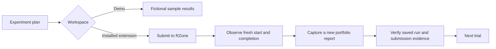

For a real trial, expand **Execution evidence** to inspect submission, running, completion, report and capture times. The receipt links the exact source submissions and document session to the saved trial. Elapsed time alone does not prove correctness: a missing or ambiguous source lifecycle stops the queue for review.

## Save a manually run backtest too

Prefer working directly in RZone? The original capture workflow remains available:

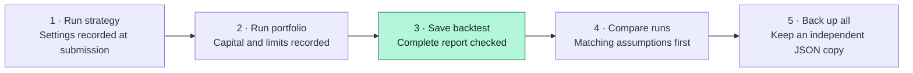

Definedge calculates the backtest. Vault records the completed report and the settings submitted before it. Editing a form afterwards does not rewrite an earlier run's settings.

| Inside a saved run | What you can inspect |
| --- | --- |
| Strategy and portfolio settings | Periods, weights, EMA/TMA, Relative Strength, rules, chart settings, capital and position limits |
| Original statistics | Report labels and source values, including missing metrics |
| Every trade page | All captured rows, including zero-quantity trades |
| Chart snapshots | Sanitized SVG graphics; underlying price series and hover data are not included |
| Research context | Capture warnings, submission linkage, editable run name and notes |

## Try the demo

Requires **Node.js 24 or newer**. The demo needs no dependency installation or Definedge login.

```sh
git clone https://github.com/mamamiya7/backtest-vault.git
cd backtest-vault
npm run preview
```

Open the [visual leaderboard](http://127.0.0.1:8767/?demo=1&view=analysis) or the [run library](http://127.0.0.1:8767/?demo=1).

Six synthetic records demonstrate Candle, P&F, Renko, comparisons, settings, notes and a capture warning. Demo changes stay in memory and reset on reload; imports are disabled. Demo exports use a `demo-` filename prefix and retain each record's `demo: true` marker.

| Inspect the settings | Arrange columns on a phone |
| --- | --- |
| 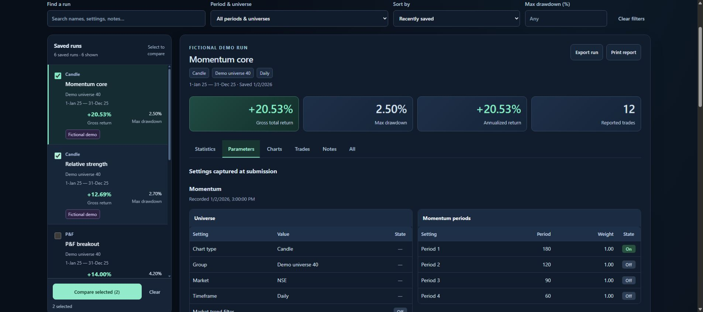 | 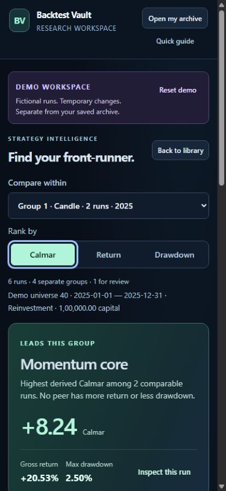 |

[Three-minute demo walkthrough](docs/DEMO.md)

## Install the extension

```text
backtest-vault/
├── dist/                 ← Select THIS folder in Chrome
│   ├── manifest.json
│   ├── index.html
│   └── capture.js
├── docs/
└── README.md
```

1. Clone the repository, or download and extract its ZIP.
2. Open Chrome's Extensions page and enable **Developer mode**.
3. Choose **Load unpacked → dist**. The manifest is inside that folder.
4. Sign in to RZone and refresh its page so the extension can connect.
5. Open Vault from the extension toolbar and choose **New test**. Connect your RZone tab and configure the test in Vault.
6. Review and run. Use **Export experiment** for that test or **Back up all** on the library page when you want a backup.

For a dashboard-only update, refresh or reopen Vault. When capture code changes, reload the same extension and refresh Definedge before submitting new runs. Back up any pending recovery before refreshing. Keep the existing extension installed to preserve its local archive. [Setup and troubleshooting](docs/INSTALL.md)

## How the ranking works

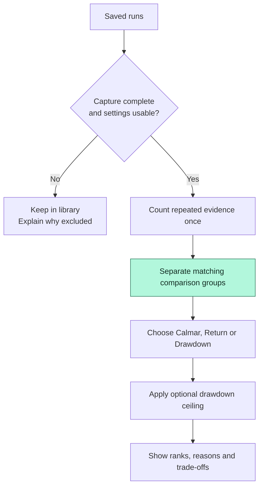

Choose **Analyze strategies** for the whole library, or **Explain comparison** for selected runs. The first view opens the group with the most comparable runs and shows a leading-run explanation, top-five table and return/drawdown plot.

### Make the table yours

Click a **column heading** once for ascending order and again for descending. The active heading shows its sort arrow. Sorting includes every run in the current scope, including flagged records with their unranked status. It does not change the selected **Rank by** measure, the leader, or the chart. Choose the current **Rank by** measure again to restore the default order. Trade-table headings also sort amounts, symbols and dates.

Drag a **table heading** left or right to move its column. Open **Columns** to show or hide metrics and drag the dotted handles up or down to arrange them. Rank and strategy stay visible. Six columns appear initially; optional choices add win ratio, reported trades, capital, dates, universe and chart model. Choices apply to both matched groups and All runs, and are saved on this browser. Demo choices are temporary. **Reset columns** restores the defaults.

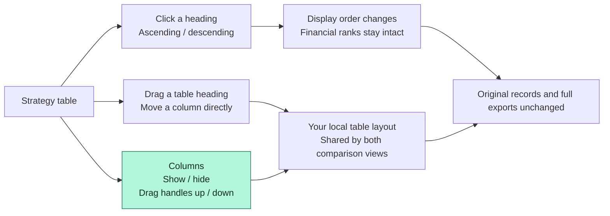

The **Rank by** menu explains the direction for each measure only when opened. Column handles also support Arrow Up / Down and Home / End; Escape cancels a drag or closes a menu.

On phones, the table scrolls sideways so every chosen column remains available. Missing values stay last in both sort directions. Metric cards keep labels and values on the same edge; long settings wrap below their labels.

### One group or every run?

Use **Compare within → All runs · exploratory** to see all strategies together, across Candle, P&F, Renko and different periods. When opened from a selection, “All runs” includes that selection; **Analyze strategies** includes the whole library.

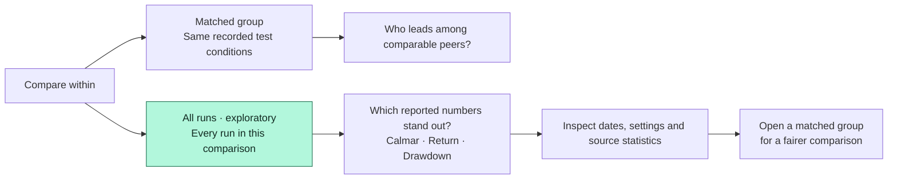

| In the all-runs view | What it tells you |
| --- | --- |
| Overall table and interactive return/drawdown map | Where eligible numbers stand; select a point for key metrics and settings |
| **Show all** and status labels | Every record stays visible; repeated saves and review-needed runs stay unranked |
| **Compare all conditions & strategy settings** | Dates, universe, sizing, chart models and submitted parameters; differences are marked |
| **Compare all reported statistics** | Original source measures side by side, including separate CAGR and Annualized Returns |
| **Buy & hold for each run’s own period** | One reference calculation per eligible run, with its own dates, capital and coverage caveats |
| **Group … · compare matched runs** | Jump from an interesting result to peers with the same recorded controls |

The all-runs order is **exploratory**, not a universal strategy winner. Longer periods, different universes and different sizing can change the order. It does not pool or average strategy summaries into portfolio performance. Fictional records mixed into a real archive remain visible but are excluded from the real ordering. Its CSV includes every run, status, recorded settings and original statistics; the matched-group CSV keeps its existing scope.

| Must match within a group | Can vary as the strategy experiment |
| --- | --- |
| Universe, market and timeframe | Periods and weights |
| Submitted start and end dates | EMA and TMA filters |
| Initial capital and allocation method | Relative Strength and selected rules |
| Maximum positions and enabled daily limit | Entry and exit conditions |
| Momentum/execution chart types and execution price mode | Other recorded strategy parameters |
| Real or fictional data status | Run name and research notes |

Matching recorded controls does not establish identical costs, dividends, cash flows, leverage, historical universe membership or valuation frequency. Those assumptions remain unverified.

| Ranking choice | What leads | How to read it |
| --- | --- | --- |
| **Return** | Highest reported gross total return | More historical gain within this group |
| **Drawdown** | Lowest reported maximum drawdown | A smaller reported fall from a previous peak |
| **Calmar** | Highest source CAGR ÷ positive maximum drawdown | More compounded yearly growth per unit of worst reported drawdown |

**Reading the plot:** higher means more reported return; further left means less reported drawdown. Mint identifies leaders, amber flags ceiling failures, and a square marks the optional index reference. Labels, ranks and exact table values supplement colour. The plot shows aggregate measures, not an equity curve.

**Click a strategy point** to open its return, drawdown, CAGR/annualized growth, Calmar, win ratio, trade count and main settings. A blue ring marks the selection. **Inspect run** also selects overlapping points; keyboard users can activate points with Enter or Space. **Open full run** goes to the original report, and **Hide details** closes the summary.

The **index square follows the selected run’s dates**, including in All runs. Its visible reference card names the run, requested/effective dates, source and price/TRI basis. Click the square or **Inspect index** for buy-and-hold growth, drawdown, Calmar and ending capital using that run’s initial capital. If history is missing or too sparse to plot drawdown, the card explains why. **Choose / import index** opens the local benchmark controls; real Nifty history is still supplied by the user.

Ties share ranks, such as **1, 1, 3**. Missing values and ceiling failures stay unranked; a single eligible run is not named a winner. An incomplete matched group gets no leader takeaway. All-runs ordering uses the selected measure directly; there is no weighted global score across unlike groups.

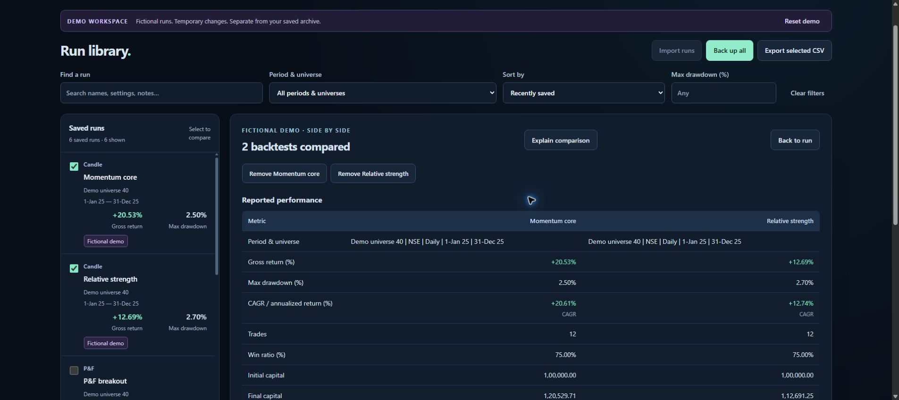

[Full comparison method, exclusions and evidence rules](docs/INTELLIGENCE.md)

## CAGR or annualized return?

The overview, yearly-return sort and side-by-side comparison use this preference:

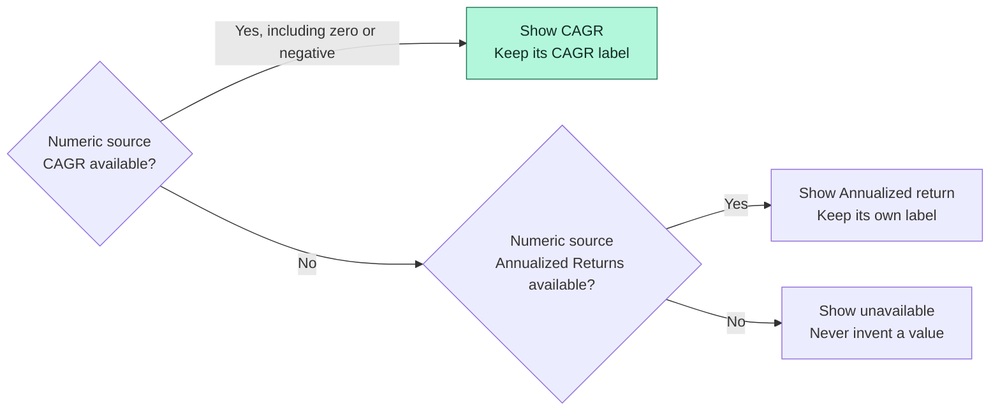

Both original fields remain in the saved record. Summary CSV includes the selected value, its measure name and separate source columns. The fallback is a display preference: **Calmar still requires source CAGR** and positive maximum drawdown.

| Illustrative inputs | Overview | Derived Calmar |
| --- | --- | --- |
| CAGR 12%, Annualized Returns 15%, MDD 8% | **+12.00% · CAGR** | **1.50** = 12 ÷ 8 |
| CAGR unavailable, Annualized Returns 15%, MDD 8% | **+15.00% · Annualized return** | Unavailable |
| CAGR 0%, Annualized Returns 15%, MDD 8% | **0.00% · CAGR** | **0.00** |
| CAGR 12%, MDD 0% | **+12.00% · CAGR** | Undefined |

Calmar is a ratio, not a percentage. Vault does not replace the source's separately labelled “Calmer Ratio.” Numbers use right alignment, Indian digit grouping, decimal measures, explicit signs and source units. Arrow annotations never become minus signs.

## Compare against Nifty buy and hold

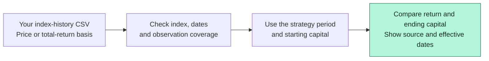

Open **Filters & benchmark → Add Nifty benchmark data**. Supply your own index-history CSV and identify whether it is a price index or total-return index. Price excludes dividends; TRI includes their reinvestment. Review the strategy's own cost/dividend treatment too.

**Actual Nifty data is not bundled or automatically fetched.** The demo benchmark is explicitly fictional. Poor date coverage can block comparison; sparse observations withhold benchmark drawdown and Calmar. Gross excess return is descriptive, not risk-adjusted alpha.

[CSV format, data sources and coverage rules](docs/INTELLIGENCE.md#nifty-buy-and-hold)

## Where your data lives

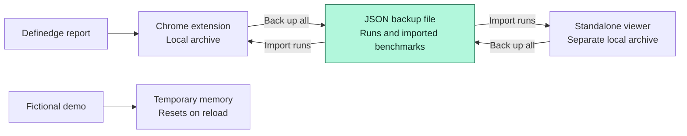

The extension and standalone viewer have separate libraries. Transfer records with JSON export/import; they do not synchronize automatically. Existing run and benchmark IDs are kept when importing duplicates.

| Export | Use it for | Complete backup? |
| --- | --- | --- |
| **Back up all · JSON** | Restore the library, including imported benchmarks | Yes |
| **Export experiment · JSON** | Keep a plan and its saved trials together | That experiment only |
| **Export run · JSON** | Move one complete run | That run only |
| **Library / selected / analysis CSV** | Review values and settings in a spreadsheet | No |
| **Trades CSV** | Inspect trade rows | No |
| **Chart SVG** | Save a static graphic | No |

The extension has no cloud account, telemetry or research upload service. Its capture access is limited to the Definedge domain. **Browser-local storage needs an independent backup.** [Privacy](PRIVACY.md)

## If a save fails

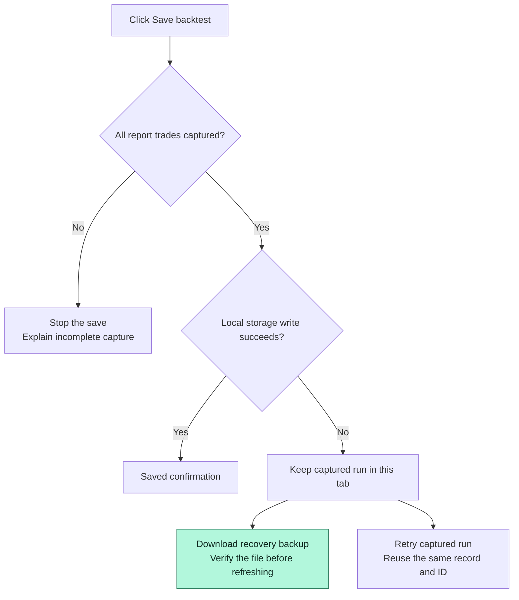

A pending recovery exists only in that tab's memory. Refreshing or closing the tab loses it. Download and verify the recovery JSON first; after restoring the extension connection, use **Import runs** in Vault. A recovery file contains the pending run, not the entire library.

[Recovery steps and common errors](docs/INSTALL.md#recovering-a-failed-storage-write)

## Scope and validation

| Supported | Limits to keep visible |
| --- | --- |
| Vault-first Candle setup, manual saving and finite trial queues | New full-setup live acceptance pending; one earlier saved-baseline batch verified; no order execution |
| Settings recorded at submission | Named rules may not expose their underlying numerical definition |
| Static report chart snapshots | No underlying price-series or hover-data capture |
| Separate, comparable strategy groups | No promised future winner or combined-portfolio performance from averaged summaries |
| Candle, P&F and Renko display adapters | Unknown layouts retain individual fields rather than guessed labels |
| Brief animations respecting reduced motion | Financial values display immediately, without animated counting |

**Validation evidence:** all nine local test suites passed for v0.7.3. They cover capture linkage, failed submissions, all trade pages, SVG sanitation, CSV formula safety, imports, formatting, CAGR fallback, comparisons, benchmark checks and demo isolation.

On 2026-09-16, a real three-trial Candle experiment completed through the installed extension's **v0.7.3 saved-baseline flow**. Its exported plan, distinct submission receipts, source statistics, trade counts, six charts per run and save-before-next-trial sequence were verified. Two settings were also calculated independently for comparison. This establishes the tested older flow; it does not validate v0.9.0's new full setup, every source layout or P&F/Renko execution. Private reports remain outside this repository.

Five exported live Candle runs previously matched their source evidence. Three P&F and three Renko runs were saved live; exported-archive comparison for that batch is pending. The user confirmed the updated saver works. Earlier dashboard revisions were checked in a standalone Chrome preview; the installed extension dashboard was not directly inspected by automation.

Definedge's Renko execution form can select **Close Only** and **High & Low** simultaneously. Vault preserves both and flags the ambiguous source state. [Known limitations](docs/LIMITATIONS.md)

## Development

Plain HTML, CSS and JavaScript live directly in `dist/`. There is no build step or runtime package dependency.

```sh
npm ci
npm test
npm run check
npm run preview
```

`jsdom` runs isolated tests; the lockfile pins its dependency tree. GitHub Actions runs the same tests, runtime checks and public-package preparation.

<details>
<summary><strong>Code map</strong></summary>

| File | Responsibility |
| --- | --- |
| `dist/capture.js` | Submission snapshots, report collection, save and recovery controls |
| `dist/background.js` | Extension dashboard entry point |
| `dist/storage.js` | Extension storage, standalone IndexedDB and isolated demo memory |
| `dist/core.js` | Validation, metric selection, CSV and SVG sanitation |
| `dist/presentation.js` | Number formatting and verified form adapters |
| `dist/intelligence.js` | Comparable groups, rankings and local index calculations |
| `dist/intelligence-ui.js` | Leaderboard, plot and explanations |
| `dist/setup.js` | Source choices, editable settings and settings-only plan validation |
| `dist/experiments-ui.js` | Guided setup, finite trial planning and Decision desk |
| `dist/experiments.js` / `experiment-coordinator.js` / `runner.js` | Approved trials, durable ownership and verified RZone execution |
| `dist/dashboard.js` | Library, report views, comparison, imports and exports |
| `dist/demo.js` | Deterministic fictional fixtures |
| `tests/` | Capture, setup, runner, queue, dashboard, presentation, demo and intelligence checks |

</details>

The diagrams use [GitHub's native Mermaid support](https://docs.github.com/en/get-started/writing-on-github/working-with-advanced-formatting/creating-diagrams). Their text source lives in this README.

Read [Contributing](CONTRIBUTING.md), [Security](SECURITY.md), [UI audit](docs/UI-AUDIT.md) and [Publication guide](docs/PUBLICATION.md).

### Prepare a distributable source copy

```sh
npm run package:public
```

This copies an explicit public-file allowlist into `releases/backtest-vault-0.9.0-public/` and writes a hash manifest. Private archives, handoffs, local hosting metadata and dependencies are excluded. An existing package is left intact.

## License and affiliation

[MIT](LICENSE). Definedge and its marks belong to their respective owners. This is an independent project, not affiliated with or endorsed by Definedge. User-owned reports and third-party data are not relicensed by this repository.

Historical backtests do not guarantee future returns.
