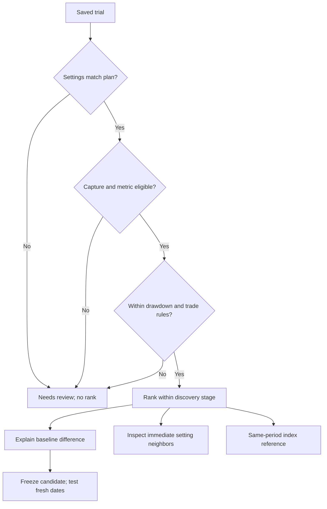

# Experiments and decision intelligence

Version 0.7.2 includes the experiment planner, local queue, Decision Desk and fictional simulation, with direct RZone connection checks and stable tab selection. The Candle executor has passed a three-trial DOM integration test. **Installed-extension and live RZone batch acceptance are still pending.** P&F/Renko plans can be prepared, but live execution is gated until their write adapters pass separate acceptance tests.

## Trader workflow

```mermaid
flowchart LR
    A[Saved baseline] --> B[Choose settings and values]
    B --> C[Preview finite run count]
    C --> D[Freeze decision rules]
    D --> E[Select RZone tab and Start]
    E --> F[Watch evidence arrive]
    F --> G[Freeze validation candidate]
    G --> H[Later validation period]
    H --> J[Final untouched holdout]
    style F fill:#b2f7dc,stroke:#247456,color:#122b22
```

1. Open a saved run and choose **Create experiment**, or open **Experiments → New experiment**.
2. Choose one to six settings. Enter explicit values, such as `126,180,252`, or `100:200:25` for start/end/step. These are input examples, not trading recommendations.
3. Choose All combinations, Budgeted sample or Adaptive. Freeze Calmar, Return or Drawdown as the objective, together with a drawdown ceiling and minimum reported trades.
4. Save the plan. Review **All trials** and **Baseline & locked context**.
5. In the installed extension, a single ready Candle RZone tab is selected automatically. With several tabs, choose one and Start. That tab must have the matching baseline configured, with existing report/settings dialogs closed. Use one designated tab for the batch.
6. Stop after current finishes capturing the active report. Resume starts the next queued trial. Closing Vault does not stop an active source tab; closing or refreshing the source tab requires recovery review.

The localhost viewer can prepare and export plans. It has no bridge to the installed extension. Import the plan JSON into the extension, then select a source tab. Import never starts execution automatically.

Vault asks registered source tabs for their current readiness instead of treating a delayed timer as a missing tab. It checks again before Start and wakes the chosen runner. A disconnected selection stays visible, with Start disabled; Vault never silently switches it to another tab. Keep Chrome, RZone and the computer running. Source execution can slow or stop if Chrome suspends the page. These readiness checks do not renew an active trial's lease or authorize replay.

## What can vary now

| Family | Planner support | Live executor status |
| --- | --- | --- |
| Candle | Active periods and weights, active EMA lengths, TMA toggle, volume, active retracement/trend-quality values, active target/stop values | Implemented; simulated integration verified; live acceptance pending |
| P&F | Above applicable fields, box size and reversal size | Planning only; live gate remains closed |
| Renko | Above applicable fields and brick-size input in the baseline's fixed mode | Planning only; live gate remains closed |
| Relative Strength, rules, chart type/mode, universe, timeframe, capital and sizing | Recorded baseline context | Locked; dynamic-layout write adapters remain on the roadmap |

An inactive length is excluded from the current sweep picker. Enable the relevant field in RZone and save a new baseline first. Market Trend Filter baselines are rejected because their separate dialog values are not captured. Named custom/RS rules remain names; their hidden numeric definitions are not inferred.

## Search modes

| Mode | How it chooses trials | Bounds |
| --- | --- | --- |
| All combinations | Every setting combination in the preview | Must fit the run budget |
| Budgeted sample | Seeded shuffle without replacement | Same values/seed reproduce the same sample |
| Adaptive | Seeded finite pool; chooses nearby queued settings around the eligible discovery leader, with every third completed step returning to exploration | Cannot add values or exceed the original pool/budget |

Adaptive search is a deterministic heuristic. It is not Bayesian optimization, an LLM, or a forecast. Validation and holdout results never feed discovery selection. All modes limit plans to 100 values per setting, 10,000 candidate combinations and 500 discovery trials. A later validation and holdout trial are explicit additions, shown before starting those stages. The default timeout is 20 minutes per trial's source-calculation sequence; final full-report capture may take longer on large reports.

## Execution and recovery

```mermaid
stateDiagram-v2
    [*] --> Queued
    Queued --> Applying: Durable ownership acquired
    Applying --> Strategy: Settings verified; intent saved
    Strategy --> Portfolio: Fresh momentum completion confirmed
    Portfolio --> Capturing: Fresh portfolio report arrives
    Capturing --> Saved: All trades, six charts, durable save verified
    Saved --> Queued: Next approved trial
    Applying --> Review: Drift or interruption
    Strategy --> Review: Rejection, timeout or disconnect
    Portfolio --> Review: Rejection, timeout or disconnect
    Capturing --> Review: Incomplete or failed save
    Review --> Saved: Reconcile matching durable result
    Review --> Skipped: User reviews and skips
```

The background worker serializes commands. A persisted lease ties one trial to one tab and document session. Before each source submission, the journal records the intent. Read-back checks cover every captured value and checkbox, not only the varied fields. Manual changes, an unexpected layout, a missing dialog or a rejected source calculation stop the experiment.

The existing saver still snapshots settings at the two submission clicks. The runner checks those frozen snapshots against its plan, uses the preassigned run ID, and captures all pages and six charts. The worker reads the stored run back before acknowledging completion. An incomplete capture never advances the queue.

An expired heartbeat marks an active trial uncertain; it does **not** make it available for automatic retry. This is deliberate: a source submission may have happened even when its acknowledgement was lost. **Check saved result** reconciles the preassigned run ID. Otherwise inspect the source and choose **Skip this trial** after the interrupted session disconnects. Create a separate deliberate run if it must be repeated. Vault prevents automatic replay; it cannot guarantee exactly-once calculation inside Definedge's service.

Storage failure retains a completed pending capture in that source tab's memory, with the existing recovery download. Refreshing loses that pending memory. An imported experiment is always paused, loses source ownership, and marks in-flight trials uncertain. Back up all includes runs, benchmarks and experiment journals; appearance preferences remain excluded. Backups containing experiments use envelope version 2 while individual run records remain schema version 1. Older archives still import.

## Decision Desk

- The leading trial is provisional while work remains. Ties are shown. Repeated report evidence stays in the journal but does not add independent ranked evidence.
- Derived Calmar uses **source CAGR / positive maximum drawdown**. Annualized Returns remains a display fallback elsewhere, not a substitute for this calculation. Missing CAGR or zero drawdown withholds Calmar.
- Neighbor checks examine trials that differ in one adjacent setting value, with every other dimension equal. The desk shows how many pass the frozen rules and their objective range. This is descriptive sensitivity, not a statistical confidence score or a causal explanation.
- Return versus baseline is a difference in percentage points. The original source numbers and the full baseline report remain available.
- Index reference uses a local benchmark collection and the chosen discovery leader's dates. Missing, sparse, fictional/real mismatch and source/basis issues remain visible. No real Nifty series is bundled or fetched. Full analysis offers additional reference inspection.
- Validation freezes one discovery candidate. Holdout freezes that validation candidate. Dates must be strictly later; scores remain separate. Selecting dates after viewing their performance does not create an untouched holdout.
- Summary returns and drawdowns are never averaged into a purported portfolio. Costs, liquidity, slippage, historical universe membership and execution assumptions remain unverified when absent from the source.

## Demo and acceptance

Open `?demo=1&view=experiments`, create a plan and choose **Simulate queue**. Synthetic series demonstrate changing ranks and queue progress; they do not execute a trading strategy. No RZone commands, extension storage, IndexedDB or network model calls are used. Reset demo clears the temporary experiments and runs. Navigation pauses a simulation; reload resets it.

Automated checks cover grid/sample bounds, malformed plans, fixed-control drift, worker restarts, concurrent claims, uncertain submissions, failed saves, staged validation, CAGR-only eligibility, a three-trial full Candle DOM flow, complete backup/import and demo isolation. These are simulated tests, not proof of the installed extension operating the live service.

## Remaining delivery plan

1. **Live Candle acceptance:** reload the updated extension, use a matching saved baseline, run three small explicitly reviewed trials, and compare exported settings, trade counts and chart counts against the source.
2. **P&F and Renko adapters:** validate three writes/runs per family, including conditional dropdowns and price-mode controls; only then open their live gates.
3. **Broader trader experiments:** RS On/Off with captured dependencies, EMA/period enable switches, predefined strategy selections, sizing experiments split into comparable cohorts, and starting from the current unsaved RZone setup.
4. **Stronger research validation:** reserve dates before discovery, multiple forward windows, neighbor heatmaps, benchmark-relative objectives with sufficient source coverage, and optional cost/liquidity gates when underlying data supports them.
5. **Optional language planning:** translate a trader's brief to the same bounded schema, show its ranges for review, and let the deterministic executor operate it. A local model/optimizer remains optional; no LLM runtime or broad network access has been added.

The technical design follows Chrome's [content-script model](https://developer.chrome.com/docs/extensions/develop/concepts/content-scripts) and [service-worker lifecycle](https://developer.chrome.com/docs/extensions/develop/concepts/service-workers/lifecycle). The split between discovery and later testing addresses the repeated-search concerns discussed in [The Probability of Backtest Overfitting](https://www.davidhbailey.com/dhbpapers/backtest-prob.pdf); it does not remove those risks by itself.
