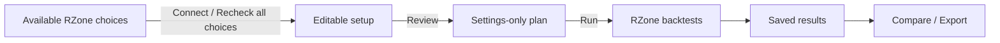
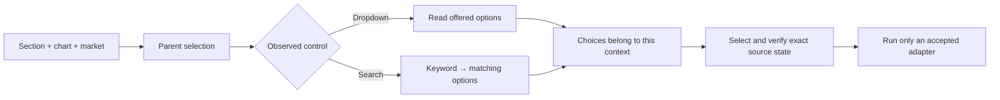
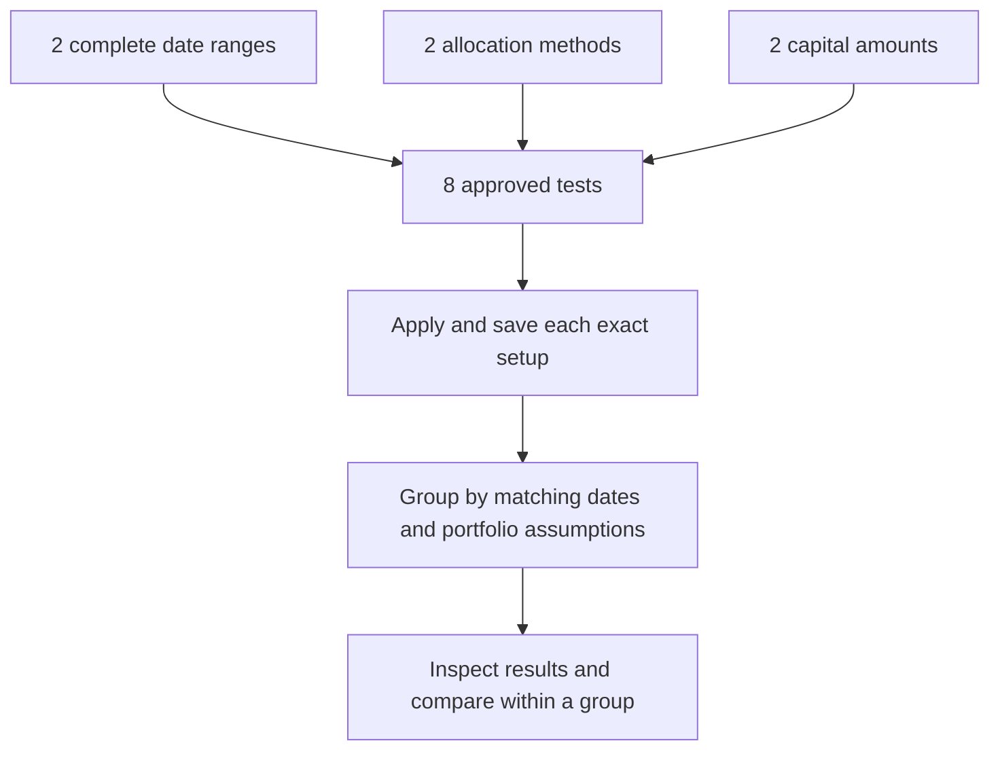
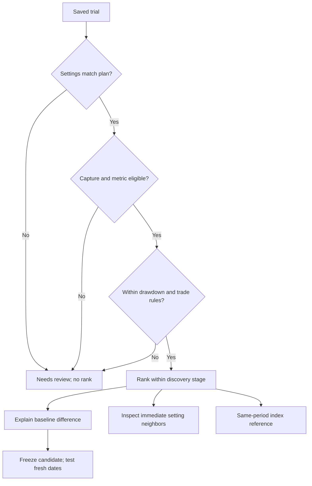

# Studies, tests and results

A **study** keeps a setup, its planned tests and the saved results together. **New test** starts that journey; you do not need to create a second item elsewhere. For example, Period 1 values `252,500` make one study with two tests.

The installed Vault opens **My studies**. A study's journey shows **Set up → Run tests → Review results**, highlights the current stage and gives the next useful action. **Compare results** is for comparing saved runs across studies. The library remains available for individual records, imports and **Back up all**.

| Stage | What to do | What starts calculations? |
| --- | --- | --- |
| **Set up** | Choose source settings and optional Test values on one page. | Nothing yet. |
| **Run tests** | Review the count and rules, then follow progress as reports save. | The explicit **Run … tests** action, or an eligible resume action. |
| **Review results** | Inspect saved reports, compare matched conditions or prepare a later-period test. | **View results** only focuses evidence. A new validation test requires its own run action. |

The journey is a noninteractive progress indicator; it cannot submit or restart a test. An unsaved setup is retained while navigating within the same open Vault tab; choose **Continue setup** from My studies. Refreshing or closing the tab clears that unsaved draft. Saved studies persist in the archive.

## Start again from a saved trial

Choose **Use these settings** beside a saved trial or on its report. Vault opens **Set up your test** with that exact run's three recorded stages: strategy, execution dates/exits and portfolio. The copy begins with one test; add Test values if you want variations. Review and Run creates a separate study. The original report and study remain unchanged, and opening a copy never submits a calculation.

The editor connects to current RZone menus and loads the saved chart contexts before copying values. Removed choices remain visible and block submission until resolved. Saved My/Public rule names need a current matching search. Reconnecting preserves edits to the copied draft. Older unsupported or incomplete settings are rejected rather than filled with current defaults. The standalone archive viewer retains its legacy plan-only builder; the installed extension provides the full editable setup.

Every study card displays its own creation timestamp, separate from the names of its baseline and saved runs.

## Dates and progress

**Test period** has one control showing the complete date range. Click the range to edit it, or use **Test values** to add another complete range alongside it. The calendar supports typed dates, month/year jumps and 1/3/5-year presets. Apply commits the pair; Cancel or Escape leaves the plan unchanged. Remove an unwanted range with ×; one remaining range becomes the fixed test period. Validation and holdout use the same range control and respect the unseen-period boundary.

The progress ring counts saved trials only. A complete stage can have fewer saved results than planned if trials were skipped. The latest-results list links to actual saved reports; old results do not replay arrival animations on each refresh. Reduced-motion preferences are respected, and return/CAGR/drawdown figures never count up.

## Remove an old study

In **My studies**, choose **Delete** beside a study, or open it and choose **Delete study**. The confirmation names the study. Cancel leaves it unchanged; Delete removes the study and its trial plan/history while keeping every saved run in the library. Export the study first to keep a copy of its plan. Deletion has no undo.

Running work cannot be deleted. Choose **Stop after current**, wait for it to settle, then delete. The background worker checks current state again so an action in another tab cannot erase an active study. Interrupted work may need review before deletion is available.

You can **start a new test in Vault without first saving a run in RZone**. Choose the strategy, backtest and portfolio settings, then run one test or a finite set of variations. RZone performs the calculations; Vault saves and compares the evidence. The user reports normal Candle tests working; broader chart execution still needs separate live acceptance. The preceding v0.7.3 saved-baseline flow passed an independently checked real three-trial Candle batch on 2026-09-16. The journey changes do not broaden that execution evidence.

## Trader workflow

```mermaid
flowchart LR
    A[New test in Vault] --> B[Set up: connect signed-in RZone]
    B --> C[One page: strategy, dates, exits and portfolio]
    C --> D[Optional Test values beside a setting]
    D --> E[Review N tests]
    E --> F[Run tests: check count and comparison rules]
    F --> G[Run N tests]
    G --> H[Review results: saved reports and comparisons]
    H --> I[My studies: return later]
    style A fill:#b2f7dc,stroke:#247456,color:#122b22
```

1. Open the **installed Vault** at **My studies**, then choose **New test**.
2. **Load choices:** open RZone and sign in if needed. **New test** automatically reads choices when exactly one RZone tab is available. With several tabs, select one and choose **Connect RZone**. Close any existing RZone report/settings dialog first; preserve an unsaved report before leaving it. A failed read allows an explicit retry and is never retried in a loop. Connecting does not submit a backtest.
3. **Set up everything on one page:** choose chart, market, four periods, timeframe and indicators. **More strategy settings** contains period weights and secondary controls. **Test period** contains dates; expand **Execution settings** within it for rank criteria, execution chart/selection, exit strategy, target and stop loss. **Portfolio** follows with capital, allocation and maximum open trades; expand **Portfolio limits** for daily limits and the required portfolio-testing setting. Portfolio defaults are checked against RZone before submission. **Group** is a searchable dropdown populated from RZone's empty-search list. Select with the mouse or use Arrow keys and Enter; execution still resolves the exact source autocomplete choice.
4. **Add Test values beside eligible controls:** use explicit numbers such as `252,500`, a numeric From/To/Step range, On/Off choices, or multiple available menu choices. Leave them unused for one test. Up to six settings can vary together. Every combination must be valid, including enabled periods, weights, rules and exits. These values are examples, not recommendations.
5. Choose **Review … tests** to check the compact setup summary and total combination count. Choose your comparison measure and limits. Source settings and their eligible Test values are edited on the main page, without opening this review first. Reviewing does not submit anything.
6. Choose **Run 1 test** or **Run … tests**. Vault applies the full approved setup, runs momentum and portfolio calculations, saves the report, and advances only after verifying the save. Leave the RZone tab's settings alone while it works.
7. At **Review results**, choose **View results** to inspect the study's saved evidence. **Export study** downloads a backup; it is optional and does not trigger another test. **Stop after current** lets the active report finish saving before pausing. **Test on another period** prepares a separate validation stage after the original results are available.

### Refresh the available choices

Native dropdown choices are cached for the **local calendar day**. The initial connection checks Candle, P&F and Renko in separate bounded steps and restores original source settings. Full menus can be reused in the same document. After a refresh or a new RZone tab, only shared **Pre/Popular** native menus cross the document boundary; Group, Radar My and keyword-search results do not. Current fields and private choices are read again, and exact source context/control checks guard shared reuse. Existing all-chart shared coverage prevents a repeated automatic scan of all three charts. Selecting another chart refreshes that context's private choices. A cache never substitutes for source read-back before submission.

Use **Recheck all choices** to discard both the current connection's cache and shared daily menus, then rescan. A new day, adapter update or changed form/menu context also requires a fresh check. RZone does not expose a stable account identifier on the backtesting page, so account-specific choices are deliberately not shared between documents. A failed chart scan leaves your current editable form available and names the incomplete chart. Keep source controls unchanged while discovery works. Search-based My/Public categories still require a keyword; the daily check does not invent a complete list for them.

The editor exposes P&F box/reversal controls, Renko brick size/mode, Running/Fresh and the observed numeric strategy inputs. Main chart and execution chart remain independent; switching one does not silently switch the other. Chart and Renko mode remain fixed within a batch, with separate drafts for each context. **P&F/Renko execution is still gated pending a real submitted-result comparison for the new adapter.**

**New test** and **Recheck all choices** read the choices available to your signed-in RZone account. Vault temporarily enables **Radar**, **Strategy 1–3** and **Exit Strategy** and records the control used by each offered category. Radar currently offers native **Pre / My** dropdowns. Strategy and exit **Pre / Popular** use dropdowns; **My / Public** replace the rule dropdown with a search field. Vault loads native menus and marks searchable categories as needing a search, rather than waiting for a dropdown that will never appear. It restores the original category, rule, timeframe where present and checkbox state, and verifies the other settings stayed unchanged. Discovery never submits a backtest.

In Vault, choose **On** or **Test both** beside Radar, a strategy or Exit Strategy, select its category, then choose its rule. For strategy/exit **My / Public**, enter a name or keyword and click **Search**. This reads matching choices from that specific RZone row and category, then restores the source. A query is required: RZone does not expose a complete list for an empty strategy search. No matches means no matches for that query, not that the entire account has no rules. Repeated names are disabled because Vault cannot safely distinguish them by name. An unfinished nonempty search in RZone must be finished or cleared before discovery can change that row. Switching loaded categories retains separate selections and Test values. A new category begins at its source placeholder or an empty selection, never at the first real rule. Unavailable choices remain visible for review. Category sources stay fixed within each batch; eligible returned rules within that category can vary.

Fresh connected setups currently support **NSE**. Other markets remain visible as unavailable because their form removes Radar and needs a separate adapter. Older templates retain their original archive behavior. Filtering the loaded Group list and switching cached categories make no additional source request. Strategy/exit **My / Public → Search** sends the entered query through RZone's own search UI, bound to its stage and row. Execution commits the exact unique returned choice; typing a strategy name alone is not treated as a selection. There is no separate catalogue download to manage.

Group discovery opens only its own search menu, clears the query to read the exposed full list, restores the original text and closes that menu before reading execution settings. It verifies that the main settings stayed unchanged and rejects ambiguous, missing or oversized lists. Existing reports/menus are never dismissed to make connection succeed. A refreshed source session requires reconnection. Group and private choices are read again; only validated shared native menus can be reused from the daily cache. Older saved setups without a Group catalogue retain their original validation behavior.

Refreshing brings RZone forward while it reads the strategy menus and opens and closes its own setup dialog. Leave the source controls alone during this brief read; manual changes interrupt discovery. Vault returns to its initiating tab afterward if you have not switched away yourself. An explicit legacy Radar/exit source refresh may retain that chosen source, while the category scan restores the source form. This is separate from **Run**.

| Item | What it contains |
| --- | --- |
| Available choices | Current source labels and dropdown options; no calculated performance |
| Setup and plan | Your selected settings, permitted variations and run count; no invented baseline result |
| Saved trial | The actual submitted settings, source statistics, all reported trade rows and six chart snapshots |

### Chart and dependent-control coverage

A consolidated live source inspection on 2026-09-16 covered the parent branches below. It checked offered values, native control types, enabled states, dependent resets, search responses and restoration. It did not calculate every strategy in a catalogue or prove that every inspected branch can run through Vault.

| Source controls inspected | Coverage | Automatic setup in this release |
| --- | --- | --- |
| Main chart and Group | Candle / P&F / Renko × four markets | NSE editor for all three charts; Candle execution |
| STR1–3 | Three rows × four rule sources × three charts | Three chart-specific editors and My/Public search; Candle execution |
| Radar | Pre / My under all three charts | NSE editor for all three charts; an empty native menu stays empty |
| Relative Strength | Separate chart rule families, five benchmark markets, exact benchmark selection | Still gated |
| Market Trend Filter | Three charts × Index/RS × four actions; four methods; exit categories; both Renko construction blocks | Still gated; requires complete capture and replay support |
| Backtest / exits | Three execution charts × Price/RS/Both × four rule sources; cross-check under all three main charts | All three Price editors, including exit My/Public search; Candle execution |
| Portfolio | Fixed / Reinvestment × portfolio switch × daily-limit switch | Existing verified six-control template |

Several visually similar controls have different behavior. Radar My is a native dropdown, while strategy/exit My is a keyword search. Candle Relative Strength has its own rule family. Changing a Renko brick mode also changes its numeric value. Changing market can remove controls. STR2 category changes can affect the raw labels captured for STR3.

Broader adapters must share one context model across discovery, editing, validation and execution. Each needs complete settings capture, source restoration tests and a real submitted-result comparison before its execution gate opens. The private audit evidence contains account-specific menus and is excluded from the public package.

### Continue from a saved run

Choose **My studies → Use a saved run**, or **Test variations** on an existing run, to keep the saved-baseline workflow. Choose the baseline, variation values and decision rules, save the plan, then select **Run … tests**. This route changes the chosen variation fields; the RZone tab must already match the saved baseline's fixed settings. **New test** is the route that applies a complete setup from Vault.

The localhost viewer can inspect archives and prepare/export saved-run plans. It has no connection to the installed extension. New connected setup and real execution require the installed Vault. Importing a plan JSON restores it paused and never starts execution automatically.

Vault asks registered source tabs for their current readiness instead of treating a delayed timer as a missing tab. It checks again before Start and wakes the chosen runner. A disconnected selection stays visible, with Start disabled; Vault never silently switches it to another tab. Keep Chrome, RZone and the computer running. Source execution can slow or stop if Chrome suspends the page. These readiness checks do not renew an active trial's lease or authorize replay.

Connecting shows reading progress in RZone's Vault bar. The dashboard bounds an unanswered connection request to 70 seconds while active, then displays an error beside Connect for a deliberate retry. Late replies do not replace newer drafts. Choice-refresh errors keep the form and your entries available. Connection attempts only read setup controls; they do not submit calculations.

Each eligible checkbox setting has one state selector in Vault:

| Choice | What the batch uses |
|---|---|
| **Off** | Skip that period or filter in every run. |
| **On** | Include it in every run. |
| **Test both** | Create separate runs with it On and Off. |

For example, Period 3 at **90**, with **Test both**, compares including and excluding that 90-bar period. **Test values** changes the numbers themselves, such as `90,120`. Combining two numbers with Test both creates four planned combinations. Other active periods and exits must still make every planned combination valid.

## Setup choices and variations

| Control | New test setup | Variation picker |
| --- | --- | --- |
| Periods, weights, EMA, TMA | Values and enable checkboxes | Numeric values and On/Off choices |
| Retracement, volume, Trend Quality | Values, references and applicable enable checkboxes | Numeric values, switches and offered references |
| Radar, Strategy 1–3, exit rule | Enable controls, source menus and loaded rule choices | Switches and rules within the selected source catalogue; Strategy rule timeframe |
| Test period | One complete date-range control | Additional complete ranges; each start stays paired with its end |
| Rank criteria | Offered RZone choices | Select one or more criteria |
| Group, market, timeframe | Selected in Vault | Fixed within discovery |
| Target and stop loss | Values and enable checkboxes | Numeric values and On/Off choices; every combination needs an exit |
| Allocation | Offered RZone choices | Select Fixed / Reinvestment when offered |
| Capital and maximum open trades | Numeric inputs | Explicit values or From / To / Step ranges |
| Daily stock limit | State and numeric input | Off / On / Test both, plus numeric values or a range |
| Relative Strength and Market Trend Filter | Must remain off for this adapter | Unavailable |
| P&F and Renko | Chart-specific editors and choice discovery available | Existing saved runs can still prepare plans; automatic execution remains gated |

The current new-test adapter is **Candle with Price selection**. Other source choices remain visibly unavailable where their dependent controls need a separate adapter. Universe, market, timeframe, chart/selection and source-menu parents stay fixed during a batch. Dates and portfolio assumptions may vary; results with different comparison conditions remain in separate groups. Choose a strategy category from its loaded choices, then select the rules to test. In the saved-run route, inactive fields remain excluded from that baseline's sweep picker. Named rules are recorded as names; hidden rule definitions are never inferred.

### Dates and portfolio variations

Use **Test values** in the date-range control to add another complete period. Two displayed ranges produce two date cases; start and end dates are never mixed across ranges. Every range requires its end strictly after its start. Duplicate ranges are included once. Date ranges combine with the other selected settings, and the review shows the resulting test count before submission. Previously saved studies retain their original independent-date combinations and can still be imported and reviewed.

Allocation and rank criteria use the same menu-value picker as strategy rules. Capital, maximum open trades and stocks per day use numeric lists or ranges. **Test both** compares the daily-limit switch separately; its inactive number is retained in the source record. Portfolio testing itself stays on because the saved result requires the full portfolio report. Rule-source categories organize available rules: choose the category, then test its rule choices.

A different period or portfolio setup is useful research, but it does not establish a universal winning strategy. Results separate those conditions and never average their return or drawdown into a combined result. Later validation and holdout dates must start after the latest actual end date already tested, including varied discovery dates.

## Search modes

| Mode | How it chooses trials | Bounds |
| --- | --- | --- |
| All combinations | Every setting combination in the preview | Must fit the run budget |
| Budgeted sample | Seeded shuffle without replacement | Same values/seed reproduce the same sample |
| Adaptive | Seeded finite pool; chooses nearby queued settings around the eligible discovery leader, with every third completed step returning to exploration | Cannot add values or exceed the original pool/budget |

When dates or portfolio conditions vary, Adaptive keeps the seeded pool order because there is no single comparable leader across those groups.

Adaptive search is a deterministic heuristic. It is not Bayesian optimization, an LLM, or a forecast. Validation and holdout results never feed discovery selection. All modes limit plans to 100 values per setting, 10,000 candidate combinations and 500 discovery trials. A later validation and holdout trial are explicit additions, shown before starting those stages. The default timeout is 20 minutes per trial's source-calculation sequence; final full-report capture may take longer on large reports.

## Execution and recovery

```mermaid
stateDiagram-v2
    [*] --> Queued
    Queued --> Applying: Durable ownership acquired
    Applying --> Strategy: Settings verified; intent saved
    Strategy --> Portfolio: Fresh momentum completion confirmed
    Portfolio --> Capturing: Fresh portfolio report arrives
    Capturing --> Saved: All trades, six charts, durable save verified
    Saved --> Queued: Next approved trial
    Applying --> Review: Drift or interruption
    Strategy --> Review: Rejection, timeout or disconnect
    Portfolio --> Review: Rejection, timeout or disconnect
    Capturing --> Review: Incomplete or failed save
    Review --> Saved: Reconcile matching durable result
    Review --> Skipped: User reviews and skips
```

The background worker serializes commands. A persisted lease ties one trial to one tab and document session. Before each source submission, the journal records the intent. Read-back checks cover every captured value and checkbox, not only the varied fields. Manual changes, an unexpected layout, a missing dialog or a rejected source calculation stop the experiment.

The existing saver still snapshots settings at the two submission clicks. A fresh strategy lifecycle requires the old completion marker to clear, the running control to appear, and the running state to end before completion is accepted. A report already present before portfolio submission cannot be attached to that new submission. Missing observations stop execution for review rather than assuming a quick response was valid.

The runner checks the frozen settings against its plan, uses the preassigned run ID, and captures all pages and six charts. Each real trial records its source document session, strategy/portfolio submission IDs, and observed submission, running, completion, report and capture times. Expand **Execution evidence** in the experiment to inspect this receipt and the trial journal. These timestamps describe observations in the browser, not independently attested server timing.

The worker reads the stored run back and verifies its exact run ID, experiment, stage, real-data status, settings and lifecycle receipt before acknowledging completion. A queued ID that already has a saved record is sent for review instead of overwritten. An incomplete or mismatched capture never advances the queue. Older results without lifecycle evidence remain in the archive but cannot establish successful execution of a new automatic trial.

An expired heartbeat marks an active trial uncertain; it does **not** make it available for automatic retry. A late heartbeat or checkpoint cannot revive it. This is deliberate: a source submission may have happened even when its acknowledgement was lost. **Check saved result** reconciles the preassigned run ID and recorded execution evidence. Otherwise inspect the source and choose **Skip this trial** after the interrupted session disconnects. Create a separate deliberate run if it must be repeated. Vault prevents automatic replay; it cannot guarantee exactly-once calculation inside Definedge's service.

Storage failure retains a completed pending capture in that source tab's memory, with the existing recovery download. Refreshing loses that pending memory. An imported experiment is always paused, loses source ownership, and marks in-flight trials uncertain. Back up all includes runs, benchmarks and experiment journals; appearance preferences remain excluded. Backups containing experiments use envelope version 2 while individual run records remain schema version 1. Older archives still import.

## Results and later-period testing

The study's **Results** section explains the evidence within matching conditions. After a complete discovery stage, **Test on another period → Prepare validation test** freezes one candidate for a separate later-period test. Preparing that plan does not start source calculations.

- The leading trial is provisional while work remains. Ties are shown. Repeated report evidence stays in the journal but does not add independent ranked evidence.
- Derived Calmar uses **source CAGR / positive maximum drawdown**. Annualized Returns remains a display fallback elsewhere, not a substitute for this calculation. Missing CAGR or zero drawdown withholds Calmar.
- Neighbor checks examine trials that differ in one adjacent numeric or On/Off setting value, with every other dimension equal. Menu choices are categorical and are not described as adjacent numbers. Results show how many checks pass the frozen rules and their objective range. This is descriptive sensitivity, not a statistical confidence score or a causal explanation.
- For a saved-run baseline, return versus baseline is a difference in percentage points and the original report remains available. A new settings-only setup has no baseline performance; Vault does not invent a comparison against it.
- Index reference uses a local benchmark collection and the chosen discovery leader's dates. Missing, sparse, fictional/real mismatch and source/basis issues remain visible. No real Nifty series is bundled or fetched. Full analysis offers additional reference inspection.
- Validation freezes one discovery candidate. Holdout freezes that validation candidate. Dates must be strictly later; scores remain separate. Selecting dates after viewing their performance does not create an untouched holdout.
- Summary returns and drawdowns are never averaged into a purported portfolio. Costs, liquidity, slippage, historical universe membership and execution assumptions remain unverified when absent from the source.

## Demo and acceptance

Open `?demo=1&view=experiments`, choose **New test**, and explore the same journey, form and inline ranges using fictional choices. **Review … tests** opens the final check; **Generate … sample results** produces examples. The saved-run demo route retains **Generate sample results**. The sample workspace uses a distinct color and reports **Sample results ready** when finished. Synthetic series demonstrate changing ranks and queue progress; they do not execute a trading strategy. No RZone commands, extension storage, IndexedDB or network model calls are used. Reset demo clears the temporary studies and runs. Navigation pauses a simulation; reload resets it. The standalone viewer identifies itself separately and cannot execute RZone plans. An imported fictional study cannot enable real execution controls.

Automated checks cover grid/sample bounds, malformed plans, fixed-control drift, worker restarts, concurrent claims, uncertain submissions, failed saves, staged validation, CAGR-only eligibility, three-trial full Candle DOM flows including dates, ranking and portfolio variations, complete backup/import and demo isolation. Date checks cover every combination before sampling, and comparisons keep unlike test conditions separate. These are simulated tests, not proof of the installed extension operating the live service.

Live acceptance on 2026-09-16 separately verified three sequential Candle period trials through the **v0.7.3 saved-baseline flow** in the installed extension. The user initiated the batch and exported its records; source operation and capture proceeded automatically. Export verification covered the approved values and fixed settings, unique strategy/portfolio submission IDs, ordered source lifecycle timestamps, complete trade counts, six chart snapshots per run and acknowledged saves before the next trial. Source metrics matched live observations and two independent manual reference calculations. The installed dashboard itself was not directly inspected by automation. **This does not establish live acceptance for v0.9.0's new full-setup and dropdown-refresh flow.**

## Remaining delivery plan

1. **Accept the Vault-first flow live:** verify connection, rule-menu refreshes, full settings application, a single run and a finite variation batch in the installed extension. The earlier saved-baseline period sweep is a separate acceptance result.
2. **P&F and Renko adapters:** validate three writes/runs per family, including conditional dropdowns and price-mode controls; only then open their live gates.
3. **Broader trader experiments:** dynamic RS/market-filter dependencies, wider variation dimensions, sizing studies separated into comparable groups, and more supported source layouts. Expand live checks for the newly editable Candle controls and recovery behavior.
4. **Stronger research validation:** reserve dates before discovery, multiple forward windows, neighbor heatmaps, benchmark-relative objectives with sufficient source coverage, and optional cost/liquidity gates when underlying data supports them.
5. **Optional language planning:** translate a trader's brief to the same bounded schema, show its ranges for review, and let the deterministic executor operate it. A local model/optimizer remains optional; no LLM runtime or broad network access has been added.

The technical design follows Chrome's [content-script model](https://developer.chrome.com/docs/extensions/develop/concepts/content-scripts) and [service-worker lifecycle](https://developer.chrome.com/docs/extensions/develop/concepts/service-workers/lifecycle). The split between discovery and later testing addresses the repeated-search concerns discussed in [The Probability of Backtest Overfitting](https://www.davidhbailey.com/dhbpapers/backtest-prob.pdf); it does not remove those risks by itself.
