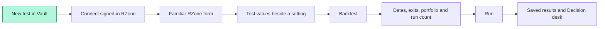
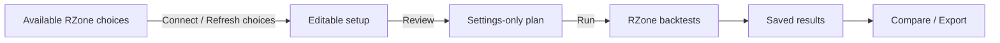
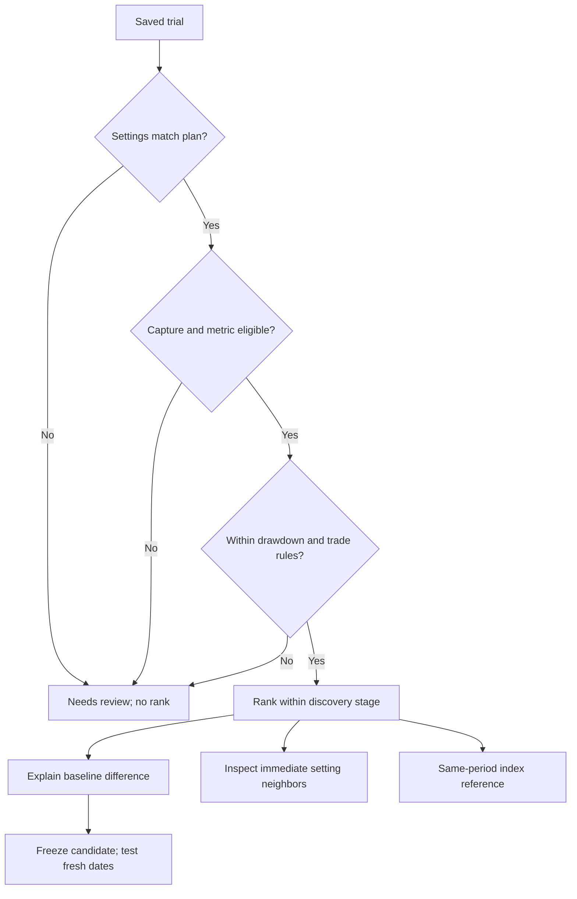

# Experiments and decision intelligence

Version 0.8.6 preview lets you **start a new test in Vault without first saving a run in RZone**. Choose the strategy, backtest and portfolio settings, then run one test or a finite set of variations. RZone performs the calculations; Vault saves and compares the evidence. The new setup flow still needs its own live acceptance. The preceding v0.7.3 saved-baseline flow passed a real three-trial Candle batch on 2026-09-16.

## Trader workflow

1. Open the **installed Vault** and choose **New test** or **Experiments → Start a new test**.
2. **Load choices:** open RZone and sign in if needed. **New test** automatically reads choices when exactly one RZone tab is available. With several tabs, select one and choose **Connect RZone**. Close any existing RZone report/settings dialog first; preserve an unsaved report before leaving it. A failed read allows an explicit retry and is never retried in a loop. Connecting does not submit a backtest.
3. **Set up the strategy in one form:** chart, market, four periods and weights, timeframe, retracement, volume, EMA/TMA, Radar, Trend Quality and Strategy 1–3 follow RZone's arrangement. **Group** is a searchable dropdown populated from RZone's empty-search list. Select with the mouse or use Arrow keys and Enter; execution still resolves the exact source autocomplete choice.
4. **Add Test values beside eligible controls:** use explicit numbers such as `252,500`, a numeric From/To/Step range, On/Off choices, or multiple available menu choices. Leave them unused for one test. Up to six settings can vary together. Every combination must be valid, including enabled periods, weights, rules and exits. These values are examples, not recommendations.
5. **Backtest:** review dates, rank criteria, target, stop loss, any exit rule, allocation, capital and position limits. Exit settings can also have test values. Portfolio defaults are editable and checked against RZone before submission. Choose your comparison measure and limits, then check the total combination count.
6. Choose **Run 1 test** or **Run … tests**. Vault applies the full approved setup, runs momentum and portfolio calculations, saves the report, and advances only after verifying the save. Leave the RZone tab's settings alone while it works.
7. Open saved trials or **Decision desk** for results. **Export experiment** downloads a backup; it is optional and does not trigger another test. **Stop after current** lets the active report finish saving before pausing.

### Refresh the available choices

**New test** and **Refresh choices** read the dropdowns available to your signed-in RZone account. For each of **Strategy 1–3**, Vault temporarily enables its source checkbox and reads each offered **Pre / My / Public / Popular** category. It restores the original category, selected rule, timeframe and checkbox state, and verifies the other settings stayed unchanged. Discovery never submits a backtest. Slow, ambiguous or incomplete reads stop with a review message instead of returning a partial catalogue.

In Vault, choose **On** or **Test both** beside a strategy, select its category, then choose its rule. Switching loaded strategy categories uses their separate lists immediately; your rule selection and Test values for each category are kept while editing. A new category begins at its source placeholder, never at the first real rule. Empty My or Public lists remain empty and cannot be enabled for a test. A choice removed by **Refresh choices** stays visible for review. Category sources stay fixed within each batch; eligible rules within that category can vary.

Changing **Market** refreshes Group. Radar and exit-source menus still refresh on demand, as do older setups without cached strategy categories. Vault does not traverse unsupported chart layouts or every possible filter combination. Searching Group and switching loaded strategy categories make no additional source request. There is no separate catalogue download to manage.

Group discovery opens only its own search menu, clears the query to read the exposed full list, restores the original text and closes that menu before reading execution settings. It verifies that the main settings stayed unchanged and rejects ambiguous, missing or oversized lists. Existing reports/menus are never dismissed to make connection succeed. A refreshed source session requires reconnection; choices are not shared between accounts or silently reused from another session. Older saved setups without a Group catalogue retain their original validation behavior.

Refreshing brings RZone forward while it reads the strategy menus and opens and closes its own setup dialog. Leave the source controls alone during this brief read; manual changes interrupt discovery. Vault returns to its initiating tab afterward if you have not switched away yourself. An explicit Radar/exit source change may retain that chosen source, while the strategy-category scan restores the source form. This is separate from **Run**.

| Item | What it contains |
| --- | --- |
| Available choices | Current source labels and dropdown options; no calculated performance |
| Setup and plan | Your selected settings, permitted variations and run count; no invented baseline result |
| Saved trial | The actual submitted settings, source statistics, all reported trade rows and six chart snapshots |

### Continue from a saved run

Choose **Experiments → Use a saved run**, or **Create experiment** on an existing run, to keep the older workflow. Choose the baseline, variation values and decision rules, then save the plan and select **Start experiment**. This route changes the chosen variation fields; the RZone tab must already match the saved baseline's fixed settings. **New test** is the route that applies a complete setup from Vault.

The localhost viewer can inspect archives and prepare/export saved-run plans. It has no connection to the installed extension. New connected setup and real execution require the installed Vault. Importing a plan JSON restores it paused and never starts execution automatically.

Vault asks registered source tabs for their current readiness instead of treating a delayed timer as a missing tab. It checks again before Start and wakes the chosen runner. A disconnected selection stays visible, with Start disabled; Vault never silently switches it to another tab. Keep Chrome, RZone and the computer running. Source execution can slow or stop if Chrome suspends the page. These readiness checks do not renew an active trial's lease or authorize replay.

Connecting shows reading progress in RZone's Vault bar. The dashboard bounds an unanswered connection request to 70 seconds while active, then displays an error beside Connect for a deliberate retry. Late replies do not replace newer drafts. Choice-refresh errors keep the form and your entries available. Connection attempts only read setup controls; they do not submit calculations.

Each eligible checkbox setting has one state selector in Vault:

| Choice | What the batch uses |
|---|---|
| **Off** | Skip that period or filter in every run. |
| **On** | Include it in every run. |
| **Test both** | Create separate runs with it On and Off. |

For example, Period 3 at **90**, with **Test both**, compares including and excluding that 90-bar period. **Test values** changes the numbers themselves, such as `90,120`. Combining two numbers with Test both creates four planned combinations. Other active periods and exits must still make every planned combination valid.

## Setup choices and variations

| Control | New test setup | Variation picker |
| --- | --- | --- |
| Periods, weights, EMA, TMA | Values and enable checkboxes | Numeric values and On/Off choices |
| Retracement, volume, Trend Quality | Values, references and applicable enable checkboxes | Numeric values, switches and offered references |
| Radar, Strategy 1–3, exit rule | Enable controls, source menus and loaded rule choices | Switches and rules within the selected source catalogue; Strategy rule timeframe |
| Group, market, timeframe, dates, rank criteria | Selected in Vault | Fixed within discovery |
| Target and stop loss | Values and enable checkboxes | Numeric values and On/Off choices; every combination needs an exit |
| Allocation, capital, open trades and daily limit | Selected in Vault | Fixed within that plan |
| Relative Strength and Market Trend Filter | Must remain off for this adapter | Unavailable |
| P&F and Renko | Automatic setup/execution gated | Existing saved runs can still prepare plans; execution remains gated |

The current new-test adapter is **Candle with Price selection**. Other source choices remain visibly unavailable where their dependent controls need a separate adapter. Shared context and source-menu parents stay fixed during a batch so comparisons use the same assumptions. Choose a strategy category from its loaded choices, then select the rules to test. In the saved-run route, inactive fields remain excluded from that baseline's sweep picker. Named rules are recorded as names; hidden rule definitions are never inferred.

## Search modes

| Mode | How it chooses trials | Bounds |
| --- | --- | --- |
| All combinations | Every setting combination in the preview | Must fit the run budget |
| Budgeted sample | Seeded shuffle without replacement | Same values/seed reproduce the same sample |
| Adaptive | Seeded finite pool; chooses nearby queued settings around the eligible discovery leader, with every third completed step returning to exploration | Cannot add values or exceed the original pool/budget |

Adaptive search is a deterministic heuristic. It is not Bayesian optimization, an LLM, or a forecast. Validation and holdout results never feed discovery selection. All modes limit plans to 100 values per setting, 10,000 candidate combinations and 500 discovery trials. A later validation and holdout trial are explicit additions, shown before starting those stages. The default timeout is 20 minutes per trial's source-calculation sequence; final full-report capture may take longer on large reports.

## Execution and recovery

```mermaid
stateDiagram-v2
    [*] --> Queued
    Queued --> Applying: Durable ownership acquired
    Applying --> Strategy: Settings verified; intent saved
    Strategy --> Portfolio: Fresh momentum completion confirmed
    Portfolio --> Capturing: Fresh portfolio report arrives
    Capturing --> Saved: All trades, six charts, durable save verified
    Saved --> Queued: Next approved trial
    Applying --> Review: Drift or interruption
    Strategy --> Review: Rejection, timeout or disconnect
    Portfolio --> Review: Rejection, timeout or disconnect
    Capturing --> Review: Incomplete or failed save
    Review --> Saved: Reconcile matching durable result
    Review --> Skipped: User reviews and skips
```

The background worker serializes commands. A persisted lease ties one trial to one tab and document session. Before each source submission, the journal records the intent. Read-back checks cover every captured value and checkbox, not only the varied fields. Manual changes, an unexpected layout, a missing dialog or a rejected source calculation stop the experiment.

The existing saver still snapshots settings at the two submission clicks. A fresh strategy lifecycle requires the old completion marker to clear, the running control to appear, and the running state to end before completion is accepted. A report already present before portfolio submission cannot be attached to that new submission. Missing observations stop execution for review rather than assuming a quick response was valid.

The runner checks the frozen settings against its plan, uses the preassigned run ID, and captures all pages and six charts. Each real trial records its source document session, strategy/portfolio submission IDs, and observed submission, running, completion, report and capture times. Expand **Execution evidence** in the experiment to inspect this receipt and the trial journal. These timestamps describe observations in the browser, not independently attested server timing.

The worker reads the stored run back and verifies its exact run ID, experiment, stage, real-data status, settings and lifecycle receipt before acknowledging completion. A queued ID that already has a saved record is sent for review instead of overwritten. An incomplete or mismatched capture never advances the queue. Older results without lifecycle evidence remain in the archive but cannot establish successful execution of a new automatic trial.

An expired heartbeat marks an active trial uncertain; it does **not** make it available for automatic retry. A late heartbeat or checkpoint cannot revive it. This is deliberate: a source submission may have happened even when its acknowledgement was lost. **Check saved result** reconciles the preassigned run ID and recorded execution evidence. Otherwise inspect the source and choose **Skip this trial** after the interrupted session disconnects. Create a separate deliberate run if it must be repeated. Vault prevents automatic replay; it cannot guarantee exactly-once calculation inside Definedge's service.

Storage failure retains a completed pending capture in that source tab's memory, with the existing recovery download. Refreshing loses that pending memory. An imported experiment is always paused, loses source ownership, and marks in-flight trials uncertain. Back up all includes runs, benchmarks and experiment journals; appearance preferences remain excluded. Backups containing experiments use envelope version 2 while individual run records remain schema version 1. Older archives still import.

## Decision Desk

- The leading trial is provisional while work remains. Ties are shown. Repeated report evidence stays in the journal but does not add independent ranked evidence.
- Derived Calmar uses **source CAGR / positive maximum drawdown**. Annualized Returns remains a display fallback elsewhere, not a substitute for this calculation. Missing CAGR or zero drawdown withholds Calmar.
- Neighbor checks examine trials that differ in one adjacent numeric or On/Off setting value, with every other dimension equal. Menu choices are categorical and are not described as adjacent numbers. The desk shows how many checks pass the frozen rules and their objective range. This is descriptive sensitivity, not a statistical confidence score or a causal explanation.
- For a saved-run baseline, return versus baseline is a difference in percentage points and the original report remains available. A new settings-only setup has no baseline performance; Vault does not invent a comparison against it.
- Index reference uses a local benchmark collection and the chosen discovery leader's dates. Missing, sparse, fictional/real mismatch and source/basis issues remain visible. No real Nifty series is bundled or fetched. Full analysis offers additional reference inspection.
- Validation freezes one discovery candidate. Holdout freezes that validation candidate. Dates must be strictly later; scores remain separate. Selecting dates after viewing their performance does not create an untouched holdout.
- Summary returns and drawdowns are never averaged into a purported portfolio. Costs, liquidity, slippage, historical universe membership and execution assumptions remain unverified when absent from the source.

## Demo and acceptance

Open `?demo=1&view=experiments`, choose **Start a new test**, and explore the same form and inline ranges using fictional choices. In the Backtest dialog, **Generate … sample results** produces examples; the saved-run demo route retains **Generate sample results**. The sample workspace uses a distinct color and reports **Sample results ready** when finished. Synthetic series demonstrate changing ranks and queue progress; they do not execute a trading strategy. No RZone commands, extension storage, IndexedDB or network model calls are used. Reset demo clears the temporary experiments and runs. Navigation pauses a simulation; reload resets it. The standalone viewer identifies itself separately and cannot execute RZone plans. An imported fictional experiment cannot enable real execution controls.

Automated checks cover grid/sample bounds, malformed plans, fixed-control drift, worker restarts, concurrent claims, uncertain submissions, failed saves, staged validation, CAGR-only eligibility, a three-trial full Candle DOM flow, complete backup/import and demo isolation. These are simulated tests, not proof of the installed extension operating the live service.

Live acceptance on 2026-09-16 separately verified three sequential Candle period trials through the **v0.7.3 saved-baseline flow** in the installed extension. The user initiated the batch and exported its records; source operation and capture proceeded automatically. Export verification covered the approved values and fixed settings, unique strategy/portfolio submission IDs, ordered source lifecycle timestamps, complete trade counts, six chart snapshots per run and acknowledged saves before the next trial. Source metrics matched live observations and two independent manual reference calculations. The installed dashboard itself was not directly inspected by automation. **This does not establish live acceptance for v0.8.6's new full-setup and dropdown-refresh flow.**

## Remaining delivery plan

1. **Accept the Vault-first flow live:** verify connection, rule-menu refreshes, full settings application, a single run and a finite variation batch in the installed extension. The earlier saved-baseline period sweep is a separate acceptance result.
2. **P&F and Renko adapters:** validate three writes/runs per family, including conditional dropdowns and price-mode controls; only then open their live gates.
3. **Broader trader experiments:** dynamic RS/market-filter dependencies, wider variation dimensions, sizing studies separated into comparable groups, and more supported source layouts. Expand live checks for the newly editable Candle controls and recovery behavior.
4. **Stronger research validation:** reserve dates before discovery, multiple forward windows, neighbor heatmaps, benchmark-relative objectives with sufficient source coverage, and optional cost/liquidity gates when underlying data supports them.
5. **Optional language planning:** translate a trader's brief to the same bounded schema, show its ranges for review, and let the deterministic executor operate it. A local model/optimizer remains optional; no LLM runtime or broad network access has been added.

The technical design follows Chrome's [content-script model](https://developer.chrome.com/docs/extensions/develop/concepts/content-scripts) and [service-worker lifecycle](https://developer.chrome.com/docs/extensions/develop/concepts/service-workers/lifecycle). The split between discovery and later testing addresses the repeated-search concerns discussed in [The Probability of Backtest Overfitting](https://www.davidhbailey.com/dhbpapers/backtest-prob.pdf); it does not remove those risks by itself.
