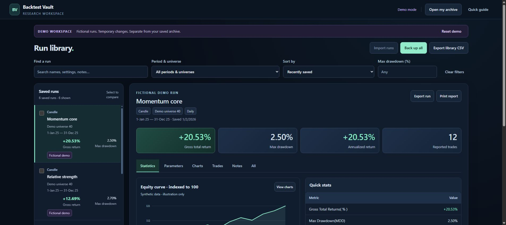
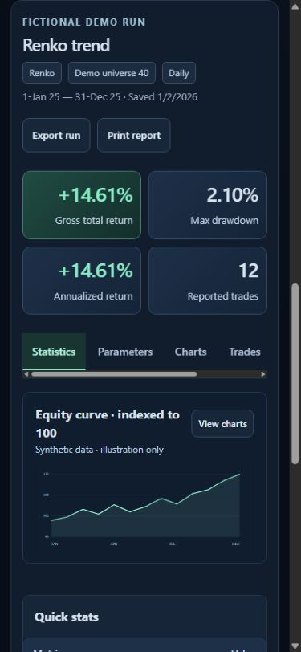
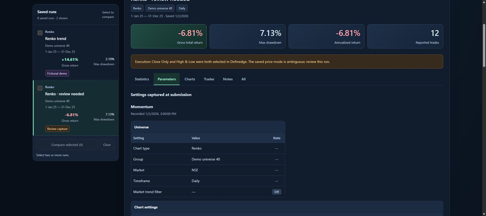
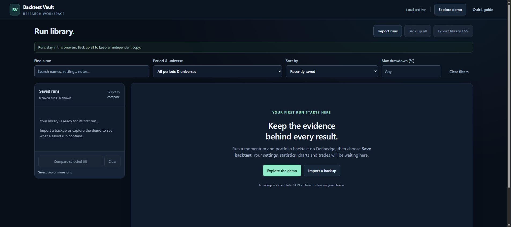
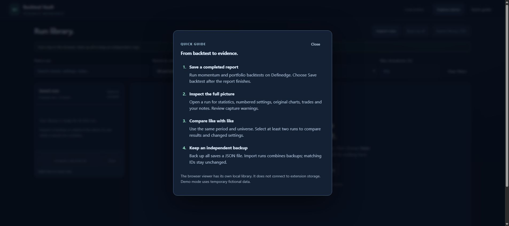

# UI / UX audit

## Compact controls and drag ordering — v0.6.1

The user's follow-up screenshot identified unnecessary column counts, sorting instructions and repeated ranking-direction labels. Removed them from the table surface. Columns is now a compact menu with visibility checkboxes and vertical drag handles. Ranking directions appear inside the Rank by menu. Optional headings can also be dragged directly across the table; fixed identity columns remain first.

Verified real mouse drags in Chrome for both a vertical menu move and a horizontal header move, with unchanged financial ranks and no accidental sort. At 390 × 844, the column menu fitted the viewport and a vertical mouse drag worked without page overflow. The menu chooses above or below its control according to available room. Automated tests cover touch-pointer handling, cancellation, short-click sorting, hidden-column ordering, keyboard moves, shared preferences and source immutability. Touch events in these tests are simulated; a real touch device and screen reader were not exercised. Existing metric alignment and reduced-motion behavior remain unchanged.

## Alignment and table controls — v0.6.0

**Date:** 2026-09-13. **Goal:** keep each label visibly attached to its value and let readers organize strategy comparisons without changing the underlying ranking.

**Scope and evidence:** reviewed the library, overview/quick statistics, Parameters, Charts, Trades, Notes, side-by-side comparison, matched-group analysis, All runs, chart/index inspectors, Quick guide and no-match filter recovery. Captured and inspected current screenshots before editing, including the user's inspector screenshot. In-app browser captures were clipped and rejected as complete visual evidence; the existing Chrome fictional demo provided accepted screenshots. Checked desktop layout and a 390 × 844 phone viewport. Raw audit captures remain private; the public screenshots contain fictional data only.

| Finding | Change / outcome |
| --- | --- |
| Inspector metric labels sat left while their values floated at the far right | Bordered metric tiles align both on the right, with consistent spacing and tabular digits |
| Long context and strategy settings needed a clearer label/value association | Left-aligned pairs share one edge; long values wrap, with one setting per row on phones |
| Library gross return and drawdown had different baselines / type sizes | Matched value size, weight and line height; retained signs, units and grouping |
| Mixed text/numeric comparison columns left some headings misaligned | Numeric-bearing column headings align with their numbers |
| Tables offered no header sorting or column selection | Strategy tables have ascending/descending headings, 14 available columns, show/hide, Left/Right and reset; trade tables sort numbers, symbols and dates |
| Phone ranking previously hid most measures by column position | All chosen columns remain in an internally scrollable table; sorting preserves its sideways position and focused heading |
| Repeated entrance fades made column changes flash | Table updates are immediate; restrained first-entry motion and reduced-motion support remain |
| Positive trade P/L omitted its sign | P/L uses explicit positive/negative signs while retaining original archive values |

**Preserved strengths:** the leading-run takeaway remains first; evidence and settings stay collapsed initially; chart selection opens the selected run's metrics and period-matched index; labels and status text supplement colour. Overview cards already paired labels and numbers well. Archived graphics and Notes needed no redesign.

**Verified interactions:** strategy header click and keyboard Enter, ascending/descending Return and Drawdown, numeric trade P/L sorting, show/hide and Left movement, reset, transfer of column choices between matched groups and All runs, original rank numbers despite display sorting, no-match filter recovery and full-run navigation. The phone table retained horizontal scroll and a visible focused heading after sorting. Inspector settings stacked without page overflow; the desktop matched-group table fit its panel with all six default columns. Temporary viewport overrides were reset.

**Regression coverage:** all six suites passed; added cases cover numeric/natural text/date order, missing-last sorting, negative values, flagged results retaining no rank, column persistence, malformed preferences, unchanged archives and complete exports. Demo tests prohibit extension storage, IndexedDB and localStorage access. Runtime/version/origin/permissions and public-file checks are part of release validation.

**Evidence limits:** this is a visual and functional audit, not accessibility certification. Screen-reader output, real-device touch, print rendering, every unknown source layout and the installed-extension dashboard remain unverified. Real research, live backtests and benchmark history were not changed or uploaded. Preference persistence was exercised with isolated local fixtures, not the user's installed extension storage.

## Visual ranking follow-up — v0.4.0

**Date:** 2026-09-13. **Scope:** strategy analysis entry, group selection, ranking controls, leader/status card, risk plot, benchmark disclosure and responsive layout. Existing library audit follows below.

1. **Before: the conclusion was buried.** A settled Chrome capture of v0.3.0 showed explanatory paragraphs, multiple groups and repeated metric/settings tables competing for attention. Baseline screenshots were captured before changes. The in-app browser captures were clipped and rejected as visual evidence; Chrome provided the accepted baseline.
2. **After: the takeaway comes first.** The screen now shows one comparable group, a leading-run takeaway and reason, a compact ranking, and a return/drawdown plot. Longer evidence and benchmark controls start collapsed. Rankings share ties and avoid a winner when a group is incomplete or lacks an eligible peer. Colour is supplemented by rank, status text, named measures and exact values. A hover-contrast defect on the selected ranking button and uneven numeric header padding were found and corrected during inspection.
3. **Interactions and narrow layout: checked.** Chrome checks covered keyboard activation of Return, Drawdown selection, a P&F singleton, applying and clearing a 2% ceiling, and switching the fictional index reference off/on. At a 390 × 844 viewport, document and scroll width both measured 375 CSS pixels with no horizontal page overflow. The phone table shows Rank, Strategy and the selected measure; the plot labels were enlarged. The temporary viewport override was reset.
4. **Motion: restrained.** Entrance fades/short vertical movement run for 320 ms, with small panel delays and 350 ms point fades. Button feedback is brief. Numbers appear at their final values immediately. Added motion is conditional on `prefers-reduced-motion: no-preference`, with an explicit reduced-motion override. The operating-system preference itself was not changed during testing.

**Validation:** all six local suites passed, including new ranking-order, tie, ceiling, missing-value, larger-cohort, disclosure, focus, direct-entry, navigation and export-scope checks. Syntax, assets, version and permissions checks passed. Browser console inspection returned no warning/error entries in the tested tab. The extended phone chart and baseline evidence remain in the private audit folder; public images use fictional data only.

**Limits:** this is a scoped functional/visual review, not a full accessibility certification. Screen-reader announcements, real-device touch, 200% text enlargement, print output, the installed extension dashboard and its live file-picker import remain outside this verification. Larger cohorts and incomplete/tied cases were tested locally with synthetic fixtures. No real Nifty performance, new backtests, user-record changes or publication are implied.

## Earlier workspace audit — v0.2.0

**Date:** 2026-09-13 
**Scope:** standalone Backtest Vault library, run inspection, settings, comparison, narrow layouts, warning states, onboarding, and help. 
**Verdict:** the tested demonstration flow is ready for review. Broader installed-extension and accessibility validation remain separate.

The starting interface had useful data preservation and numerical formatting, but spent too much space before the results. Settings were lengthy, comparison selections lacked clear recovery controls, and the file-input styling exposed a native picker inside the header action. Current-run screenshots were captured before implementation; those private research screenshots remain outside the public source package. The evidence below contains only fictional data or an empty library.

## 1. Library and overview — healthy in the tested flow

The hierarchy now puts the library and selected result together, names the chart type, and presents aligned headline metrics. The first archived chart appears beside quick statistics; secondary statistical groups are collapsed until needed. The import action uses a proper keyboard-operable button.

**Checked:** initial selection, visible number signs and units, chart rendering, temporary demo notes, and a real Chrome JSON download. The downloaded backup exactly matched all six generated sample records before the notes edit. 
**Remaining:** original source charts are static images; dense axis text can become small on phones.

## 2. Settings — healthy for supported layouts

Known settings remain numbered and grouped. Two-column groups use desktop space; narrow screens stack them. The original captured fields remain available in a collapsed disclosure.

**Checked:** Period 1–4, EMA 1–3, TMA Trend, Strategy 1–3, Relative Strength, independent execution settings, On/Off states, and complete source-field coverage in synthetic tests. 
**Remaining:** unknown forms intentionally fall back to individual fields. Hidden rule definitions are not inferred.

## 3. Comparison — healthy in the tested flow

Selected runs have a persistent count, a Clear action, and explicit removal controls in comparison. Hidden selections remain counted when a filter changes. CSV exports use the selection when at least two runs are selected; otherwise they use the filtered library.

**Checked:** selecting two runs, changed settings, numeric alignment, removal/clear, and retained selection after a Renko text filter. Selected CSV contents were verified in the isolated dashboard test. 
**Remaining:** wide comparison tables scroll internally. Different periods and universes still require judgment; the app warns rather than pretending they are comparable.

## 4. Narrow layout and keyboard — healthy in the checks performed

The library stacks above the detail view. Opening a run on a narrow screen brings its detail into view. Metrics use two columns; section tabs and wide tables scroll within their own areas.

**Checked:** a 390 × 844 browser viewport; document width equalled scroll width at 375 CSS pixels after the scrollbar. At a 1024 × 768 viewport, both were 1009 pixels. Arrow-key navigation moved selection and focus between section tabs. The viewport override was reset afterward. 
**Accessibility improvements:** explicit tab/panel relationships, one active tab stop, visible focus treatment, labelled scrolling regions, native dialog, live status text, non-colour On/Off and warning labels, and reduced-motion styles. 
**Remaining:** no claim of full WCAG compliance. Screen readers, real-device touch, 200% text enlargement, and print-device behavior have not been comprehensively tested.

## 5. Capture warnings — healthy in the tested example

A deliberately ambiguous fictional Renko run displays the source conflict prominently. Its negative result keeps an explicit minus sign. Warning logic and original source values remain separate from visual formatting.

**Checked:** both selected execution price modes are retained and the ambiguity warning appears. The same fixture exercises the presentation adapter and capture assessment. 
**Remaining:** the underlying vendor form defect is external; Vault does not silently repair it.

## 6. Empty library — healthy in the tested flow

First-use instructions explain how a report gets into the library and offer a demo or backup import. Empty backup and CSV actions are disabled. The empty state explains that storage is local.

**Checked:** an empty standalone library, demo entry, visible import action, and disabled empty exports. 
**Remaining:** the installed extension's browser file picker could not be completed through automation. The standalone and extension libraries are separate.

## 7. Quick guide — healthy in the tested flow

A short native dialog covers saving, inspection, comparison, and independent backups, with the storage distinction stated plainly.

**Checked:** open, initial focus on Close, Escape dismissal, and return to the demo. 
**Remaining:** assistive-technology announcements were not independently tested.

## Validation and public-demo boundaries

- All four local test suites passed: capture, dashboard, presentation, and demo isolation.
- Static checks passed for runtime syntax, local assets, manifest entrypoints, version consistency, and unchanged domain permissions.
- Demo mode was tested with storage accessors that throw on any attempt to open durable storage; no such access occurred.
- Demo notes saved temporarily and Reset demo restored the original records and filters.
- Public images show only synthetic records or empty/help states. No actual research records are in the public allowlist.
- No hosted site or public Git repository was created or pushed.
- Live P&F/Renko exported-archive verification is still pending; this UI audit does not replace that validation.
